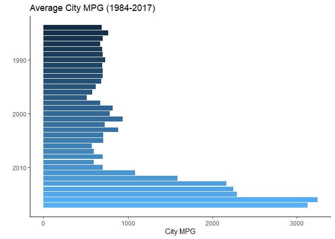
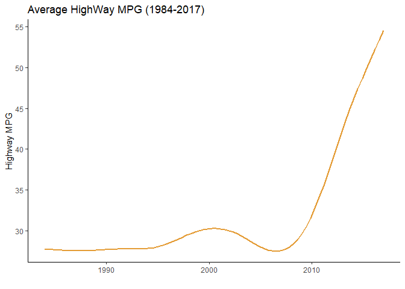
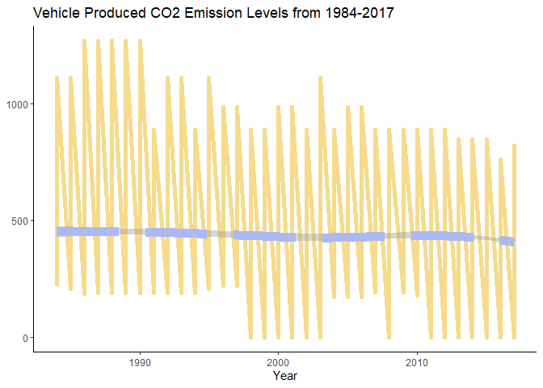

### Data Visualization Project 01

# Libraries
Let's load the necessary packages before starting the data analysis


```r
library(tidyverse)
library(ggplot2)
library(dplyr)
```


# Loading the Data
The dataset for this project is `fuel.csv`, which contains fuel economy data produced during vehicle testing from the 1984-2017. 


```r
fuel_raw <- read_csv("../data/project-01/fuel.csv")
fuel_raw
```

```
## # A tibble: 38,113 x 81
##    vehicle_id  year make    model   class   drive  transmission transmission_ty~
##         <dbl> <dbl> <chr>   <chr>   <chr>   <chr>  <chr>        <chr>           
##  1      26587  1984 Alfa R~ GT V6 ~ Minico~ <NA>   Manual 5-Sp~ <NA>            
##  2      27705  1984 Alfa R~ GT V6 ~ Minico~ <NA>   Manual 5-Sp~ <NA>            
##  3      26561  1984 Alfa R~ Spider~ Two Se~ <NA>   Manual 5-Sp~ <NA>            
##  4      27681  1984 Alfa R~ Spider~ Two Se~ <NA>   Manual 5-Sp~ <NA>            
##  5      27550  1984 AM Gen~ DJ Po ~ Specia~ 2-Whe~ Automatic 3~ <NA>            
##  6      28426  1984 AM Gen~ DJ Po ~ Specia~ 2-Whe~ Automatic 3~ <NA>            
##  7      27549  1984 AM Gen~ FJ8c P~ Specia~ 2-Whe~ Automatic 3~ <NA>            
##  8      28425  1984 AM Gen~ FJ8c P~ Specia~ 2-Whe~ Automatic 3~ <NA>            
##  9      27593  1984 Americ~ Eagle ~ Specia~ 4-Whe~ Automatic 3~ <NA>            
## 10      28455  1984 Americ~ Eagle ~ Specia~ 4-Whe~ Automatic 3~ <NA>            
## # ... with 38,103 more rows, and 73 more variables: engine_index <dbl>,
## #   engine_descriptor <chr>, engine_cylinders <dbl>, engine_displacement <dbl>,
## #   turbocharger <lgl>, supercharger <lgl>, fuel_type <chr>, fuel_type_1 <chr>,
## #   fuel_type_2 <lgl>, city_mpg_ft1 <dbl>, unrounded_city_mpg_ft1 <dbl>,
## #   city_mpg_ft2 <dbl>, unrounded_city_mpg_ft2 <dbl>,
## #   city_gasoline_consumption_cd <dbl>, city_electricity_consumption <dbl>,
## #   city_utility_factor <dbl>, highway_mpg_ft1 <dbl>, ...
```

---

# Plot 1

<p style='text-align: justify;'>As can be seen, this data analysis uses `fuel.csv`. Given that the data is during a range of time from 1984 to 2017, this analysis will explore the question of whether or not vehicle efficiency has improved within this time. Therefore, most of the analyses will be made taking the year into account. For the first analysis plot, I wanted to determine if overall vehicle efficiency has improved with regards to miles per gallon within a city setting. The following details my findings.</p>


```r
# cutting down the dataset to only the city mpg
fuel_by_city <- fuel_raw %>%
  count(year, city_mpg_ft1)
```


```r
ggplot(data = fuel_by_city, mapping = aes(x = year, y = city_mpg_ft1)) + 
  geom_col(aes(fill = year)) +
  coord_flip() + 
  scale_x_reverse() +
  theme_classic() +
  theme(legend.position = "none") +
  labs(title = "Average City MPG (1984-2017)",
       x = "", y = "City MPG")
```

<!-- -->

<p style='text-align: justify;'>We can see from the generated plot that within the time frame, vehicle efficiency in the city starts relatively low and remains that way until around 2010, when efficiency within the city continually rises until it reaches an all-time high in 2016, with 2017 being only slightly less. There can be many different speculations as to why this is the case, one guess would be that the 2008 financial crisis introduced a new need and market for cars that have more efficiency in the city.</p>

---

# Plot 2

<p style='text-align: justify;'>For my second plot, I wanted to go ahead and do the same but for highway MPG, this way, we can determine the trend within the time frame regarding vehicle efficiency in the highway setting</p>


```r
fuel_by_highway <- fuel_raw %>%
  count(year, highway_mpg_ft1)
```


```r
ggplot(data = fuel_by_highway, mapping = aes(x = year, y = highway_mpg_ft1)) + 
  geom_smooth(color = "#e49c36", method = "gam", se = FALSE) +
  theme_classic() +
    labs(title = "Average HighWay MPG (1984-2017)",
       x = "", y = "Highway MPG")
```

<!-- -->

<p style='text-align: justify;'>From the results, it can be seen that the trend in highway efficiency differs in some way to that for city MPG, however, this trend is far more drastic, and overall highway MPG starts off relatively low, witnesses a slow and steady increase until b=just before 2000, where it faces a slow and study decline until, similarly to city MPG, it begins a rapid increase reaching an all time high. Once again the reason for this trend can be speculated as being a result of technological advancements or as a response to the 2008 financial crisis.</p>

---

# Plot 3

<p style='text-align: justify;'>For my final graph I wanted to see the trend in CO~2~ emissions through the years. With this analysis I want to see which vehicle can be considered overall the most environmentally friendly.</p>


```r
emissions_by_year <- fuel_raw %>%
  count(year, tailpipe_co2_in_grams_mile_ft1) %>%
  group_by(year) 

emissions_by_year
```

```
## # A tibble: 2,911 x 3
## # Groups:   year [34]
##     year tailpipe_co2_in_grams_mile_ft1     n
##    <dbl>                          <dbl> <int>
##  1  1984                           217.     1
##  2  1984                           228.     1
##  3  1984                           247.     1
##  4  1984                           248.     1
##  5  1984                           254.     1
##  6  1984                           254.     1
##  7  1984                           261.     2
##  8  1984                           261.     5
##  9  1984                           268.     3
## 10  1984                           269.     3
## # ... with 2,901 more rows
```


```r
ggplot(data = emissions_by_year, mapping = aes(x = year, y = tailpipe_co2_in_grams_mile_ft1)) +
  geom_line(color = "#F5DB8B", size = 2, linetype = "solid") +
  geom_smooth(method = "loess", se = TRUE, color = "#ABB9F5", size = 4, linetype = 5, formula = y~x) +
  theme_classic() +
  labs(title = "Vehicle Produced CO2 Emission Levels from 1984-2017",
       x = "Year", y = NULL)
```

<!-- -->

<p style='text-align: justify;'>It is actually difficult to determine a trend in CO~2~ emissions throughout years. This may signify that little to nothing has been done to reduce CO~2~ emissions by vehicles of all types. Of course, there is a small but visible downward trend in the highest and lowest number of CO~2~ emissions, but this trend is very small and would not be determined as statistically significant.</p>

---

# Conclusion

<p style='text-align: justify;'>The data set I used in this project, `file.csv`, contains fuel economy data produced during vehicle testing at the Environmental Protection Agency’s (EPA) National Vehicle and Fuel Emissions Laboratory from 1984 to 2017. From this, I already know that I want to explore what trends could be in the data, and determine if the overall "environmentally friendliness" of automobiles in the U.S. has improved or worsened within this time frame. First, let's look at efficiency, the first two data visualizations show how much the average MPG in both the city and the highway have changed over time. We can see that the fuel efficiency drops starting with 1986, and continues to do so until 2005, when the MPG has a drastic and steady increase until 2017. This could very likely be for technological reasons. On the basis of overall vehicle efficiency, it can be determined from the data that vehicles have become more fuel efficient over time. The last graph looks at the amount of CO~2~ emissions through each year in the data set to determine if emissions have increased or decreased. Based on the results, it does not appear as though CO~2~ emissions have changed throughout the years. There is a slight decrease, however this decrease is very small.</p>

<p style='text-align: justify;'>There are many more visualizations that can be made from this data set, such as the CO~2~ emissions throughout the years produced by different car models, which can be used to determine which models have had the worst effect on CO~2~ levels.</p>
