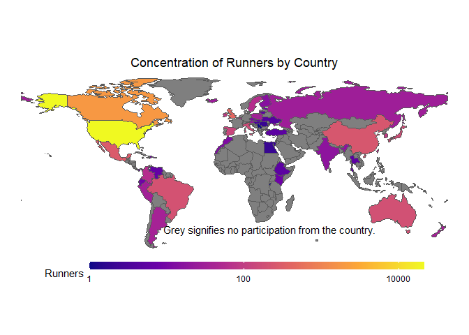
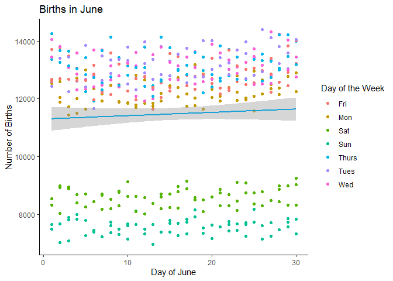
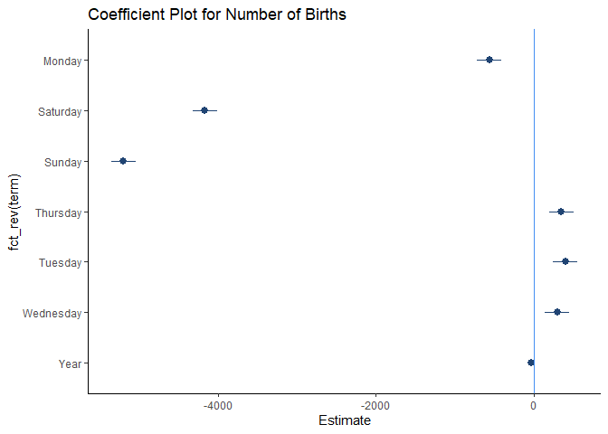

# Data Visualization Project 02

---


```r
library(tidyverse)
library(ggplot2)
library(dplyr)
library(ggrepel)
# For Interactive Model
library(plotly)
library(htmlwidgets)
# For Spatial Visualization
library(sf)
library(maps)
# For Model Visualization
library(broom)
library(coefplot)
```

---

# Creating an Interactive Plot


```r
summer_hits = read_csv("../data/project-02/all_billboard_summer_hits.csv")
summer_hits
```

```
## # A tibble: 600 x 22
##    danceability energy key   loudness mode  speechiness acousticness
##           <dbl>  <dbl> <chr>    <dbl> <chr>       <dbl>        <dbl>
##  1        0.518  0.06  A#      -14.9  major      0.0441        0.987
##  2        0.543  0.332 C       -11.6  major      0.0317        0.669
##  3        0.541  0.676 C        -7.99 major      0.135         0.188
##  4        0.408  0.397 A       -12.5  major      0.03          0.873
##  5        0.554  0.189 E       -14.3  major      0.0279        0.915
##  6        0.679  0.279 G       -10.4  major      0.0384        0.645
##  7        0.663  0.619 F#       -5.73 major      0.0334        0.336
##  8        0.684  0.556 B       -10.6  major      0.0377        0.468
##  9        0.645  0.943 C        -1.53 major      0.0393        0.385
## 10        0.388  0.434 G       -12.0  major      0.0354        0.789
## # ... with 590 more rows, and 15 more variables: instrumentalness <dbl>,
## #   liveness <dbl>, valence <dbl>, tempo <dbl>, track_uri <chr>,
## #   duration_ms <dbl>, time_signature <dbl>, key_mode <chr>,
## #   playlist_name <chr>, playlist_img <chr>, track_name <chr>,
## #   artist_name <chr>, album_name <chr>, album_img <chr>, year <dbl>
```

<p style='text-align: justify;font-family:verdana'>For my first visualization I thought about a criticism I've heard about modern music, in that it is over compressed and [getting louder and louder](https://www.bbc.com/news/entertainment-arts-35250557). With a set of data that provides information about the loudness of summer hits from 1958 to 2015, this was an opportunity to see if there truly is a trend in the data that suggests music is getting louder. A scatter plot was always my intended graph to use for this, however, <b>_I would have liked if the data included the genre of each track_</b>, so I would be able to color each point based on the different genres to also see if an increase in loudness also correlates with a shift in the most industry-dominant genre. Aside from this, there was no cleaning and/or filtering necessary for the data visualization that I wanted.</p>

```r
# Create a scatter plot with the color crimson
loud_graph <- ggplot(summer_hits, aes(year, loudness)) +
  geom_point(color = "#990000") +
  # I will use Local regression because looking at the scatter plot, there seems to be a trend but the correlation is weak-positice
  geom_smooth(method = "loess", formula = "y ~ x", se = FALSE, color = "black") +
  scale_x_log10() +
  theme_classic() +
  labs(title = "Summer Hit Loudness Over Time",
       x = "Year", y = "Loudness") +
  theme(legend.position = "bottom")
# Applying "plotly" interactivity to the regression plot
loudness <- ggplotly(loud_graph, tooltip = "text")
loudness
```

```{=html}
<div id="htmlwidget-1157250f430a7e904961" style="width:672px;height:480px;" class="plotly html-widget"></div>
<script type="application/json" data-for="htmlwidget-1157250f430a7e904961">{"x":{"data":[{"x":[3.29181268746712,3.29181268746712,3.29181268746712,3.29181268746712,3.29181268746712,3.29181268746712,3.29181268746712,3.29181268746712,3.29181268746712,3.29181268746712,3.29203443599474,3.29203443599474,3.29203443599474,3.29203443599474,3.29203443599474,3.29203443599474,3.29203443599474,3.29203443599474,3.29203443599474,3.29203443599474,3.29225607135648,3.29225607135648,3.29225607135648,3.29225607135648,3.29225607135648,3.29225607135648,3.29225607135648,3.29225607135648,3.29225607135648,3.29225607135648,3.29247759366778,3.29247759366778,3.29247759366778,3.29247759366778,3.29247759366778,3.29247759366778,3.29247759366778,3.29247759366778,3.29247759366778,3.29247759366778,3.29269900304393,3.29269900304393,3.29269900304393,3.29269900304393,3.29269900304393,3.29269900304393,3.29269900304393,3.29269900304393,3.29269900304393,3.29269900304393,3.29292029960001,3.29292029960001,3.29292029960001,3.29292029960001,3.29292029960001,3.29292029960001,3.29292029960001,3.29292029960001,3.29292029960001,3.29292029960001,3.29314148345093,3.29314148345093,3.29314148345093,3.29314148345093,3.29314148345093,3.29314148345093,3.29314148345093,3.29314148345093,3.29314148345093,3.29314148345093,3.29336255471145,3.29336255471145,3.29336255471145,3.29336255471145,3.29336255471145,3.29336255471145,3.29336255471145,3.29336255471145,3.29336255471145,3.29336255471145,3.29358351349612,3.29358351349612,3.29358351349612,3.29358351349612,3.29358351349612,3.29358351349612,3.29358351349612,3.29358351349612,3.29358351349612,3.29358351349612,3.29380435991934,3.29380435991934,3.29380435991934,3.29380435991934,3.29380435991934,3.29380435991934,3.29380435991934,3.29380435991934,3.29380435991934,3.29380435991934,3.29402509409532,3.29402509409532,3.29402509409532,3.29402509409532,3.29402509409532,3.29402509409532,3.29402509409532,3.29402509409532,3.29402509409532,3.29402509409532,3.29424571613812,3.29424571613812,3.29424571613812,3.29424571613812,3.29424571613812,3.29424571613812,3.29424571613812,3.29424571613812,3.29424571613812,3.29424571613812,3.29446622616159,3.29446622616159,3.29446622616159,3.29446622616159,3.29446622616159,3.29446622616159,3.29446622616159,3.29446622616159,3.29446622616159,3.29446622616159,3.29468662427944,3.29468662427944,3.29468662427944,3.29468662427944,3.29468662427944,3.29468662427944,3.29468662427944,3.29468662427944,3.29468662427944,3.29468662427944,3.29490691060519,3.29490691060519,3.29490691060519,3.29490691060519,3.29490691060519,3.29490691060519,3.29490691060519,3.29490691060519,3.29490691060519,3.29490691060519,3.29512708525219,3.29512708525219,3.29512708525219,3.29512708525219,3.29512708525219,3.29512708525219,3.29512708525219,3.29512708525219,3.29512708525219,3.29512708525219,3.29534714833362,3.29534714833362,3.29534714833362,3.29534714833362,3.29534714833362,3.29534714833362,3.29534714833362,3.29534714833362,3.29534714833362,3.29534714833362,3.29556709996248,3.29556709996248,3.29556709996248,3.29556709996248,3.29556709996248,3.29556709996248,3.29556709996248,3.29556709996248,3.29556709996248,3.29556709996248,3.29578694025161,3.29578694025161,3.29578694025161,3.29578694025161,3.29578694025161,3.29578694025161,3.29578694025161,3.29578694025161,3.29578694025161,3.29578694025161,3.29600666931367,3.29600666931367,3.29600666931367,3.29600666931367,3.29600666931367,3.29600666931367,3.29600666931367,3.29600666931367,3.29600666931367,3.29600666931367,3.29622628726116,3.29622628726116,3.29622628726116,3.29622628726116,3.29622628726116,3.29622628726116,3.29622628726116,3.29622628726116,3.29622628726116,3.29622628726116,3.2964457942064,3.2964457942064,3.2964457942064,3.2964457942064,3.2964457942064,3.2964457942064,3.2964457942064,3.2964457942064,3.2964457942064,3.2964457942064,3.29666519026153,3.29666519026153,3.29666519026153,3.29666519026153,3.29666519026153,3.29666519026153,3.29666519026153,3.29666519026153,3.29666519026153,3.29666519026153,3.29688447553855,3.29688447553855,3.29688447553855,3.29688447553855,3.29688447553855,3.29688447553855,3.29688447553855,3.29688447553855,3.29688447553855,3.29688447553855,3.29710365014926,3.29710365014926,3.29710365014926,3.29710365014926,3.29710365014926,3.29710365014926,3.29710365014926,3.29710365014926,3.29710365014926,3.29710365014926,3.2973227142053,3.2973227142053,3.2973227142053,3.2973227142053,3.2973227142053,3.2973227142053,3.2973227142053,3.2973227142053,3.2973227142053,3.2973227142053,3.29754166781816,3.29754166781816,3.29754166781816,3.29754166781816,3.29754166781816,3.29754166781816,3.29754166781816,3.29754166781816,3.29754166781816,3.29754166781816,3.29776051109913,3.29776051109913,3.29776051109913,3.29776051109913,3.29776051109913,3.29776051109913,3.29776051109913,3.29776051109913,3.29776051109913,3.29776051109913,3.29797924415936,3.29797924415936,3.29797924415936,3.29797924415936,3.29797924415936,3.29797924415936,3.29797924415936,3.29797924415936,3.29797924415936,3.29797924415936,3.29819786710982,3.29819786710982,3.29819786710982,3.29819786710982,3.29819786710982,3.29819786710982,3.29819786710982,3.29819786710982,3.29819786710982,3.29819786710982,3.29841638006129,3.29841638006129,3.29841638006129,3.29841638006129,3.29841638006129,3.29841638006129,3.29841638006129,3.29841638006129,3.29841638006129,3.29841638006129,3.29863478312444,3.29863478312444,3.29863478312444,3.29863478312444,3.29863478312444,3.29863478312444,3.29863478312444,3.29863478312444,3.29863478312444,3.29863478312444,3.29885307640971,3.29885307640971,3.29885307640971,3.29885307640971,3.29885307640971,3.29885307640971,3.29885307640971,3.29885307640971,3.29885307640971,3.29885307640971,3.29907126002741,3.29907126002741,3.29907126002741,3.29907126002741,3.29907126002741,3.29907126002741,3.29907126002741,3.29907126002741,3.29907126002741,3.29907126002741,3.29928933408768,3.29928933408768,3.29928933408768,3.29928933408768,3.29928933408768,3.29928933408768,3.29928933408768,3.29928933408768,3.29928933408768,3.29928933408768,3.29950729870049,3.29950729870049,3.29950729870049,3.29950729870049,3.29950729870049,3.29950729870049,3.29950729870049,3.29950729870049,3.29950729870049,3.29950729870049,3.29972515397564,3.29972515397564,3.29972515397564,3.29972515397564,3.29972515397564,3.29972515397564,3.29972515397564,3.29972515397564,3.29972515397564,3.29972515397564,3.29994290002277,3.29994290002277,3.29994290002277,3.29994290002277,3.29994290002277,3.29994290002277,3.29994290002277,3.29994290002277,3.29994290002277,3.29994290002277,3.30016053695135,3.30016053695135,3.30016053695135,3.30016053695135,3.30016053695135,3.30016053695135,3.30016053695135,3.30016053695135,3.30016053695135,3.30016053695135,3.3003780648707,3.3003780648707,3.3003780648707,3.3003780648707,3.3003780648707,3.3003780648707,3.3003780648707,3.3003780648707,3.3003780648707,3.3003780648707,3.30059548388996,3.30059548388996,3.30059548388996,3.30059548388996,3.30059548388996,3.30059548388996,3.30059548388996,3.30059548388996,3.30059548388996,3.30059548388996,3.30081279411812,3.30081279411812,3.30081279411812,3.30081279411812,3.30081279411812,3.30081279411812,3.30081279411812,3.30081279411812,3.30081279411812,3.30081279411812,3.30102999566398,3.30102999566398,3.30102999566398,3.30102999566398,3.30102999566398,3.30102999566398,3.30102999566398,3.30102999566398,3.30102999566398,3.30102999566398,3.30124708863621,3.30124708863621,3.30124708863621,3.30124708863621,3.30124708863621,3.30124708863621,3.30124708863621,3.30124708863621,3.30124708863621,3.30124708863621,3.3014640731433,3.3014640731433,3.3014640731433,3.3014640731433,3.3014640731433,3.3014640731433,3.3014640731433,3.3014640731433,3.3014640731433,3.3014640731433,3.30168094929358,3.30168094929358,3.30168094929358,3.30168094929358,3.30168094929358,3.30168094929358,3.30168094929358,3.30168094929358,3.30168094929358,3.30168094929358,3.30189771719521,3.30189771719521,3.30189771719521,3.30189771719521,3.30189771719521,3.30189771719521,3.30189771719521,3.30189771719521,3.30189771719521,3.30189771719521,3.3021143769562,3.3021143769562,3.3021143769562,3.3021143769562,3.3021143769562,3.3021143769562,3.3021143769562,3.3021143769562,3.3021143769562,3.3021143769562,3.3023309286844,3.3023309286844,3.3023309286844,3.3023309286844,3.3023309286844,3.3023309286844,3.3023309286844,3.3023309286844,3.3023309286844,3.3023309286844,3.30254737248749,3.30254737248749,3.30254737248749,3.30254737248749,3.30254737248749,3.30254737248749,3.30254737248749,3.30254737248749,3.30254737248749,3.30254737248749,3.30276370847298,3.30276370847298,3.30276370847298,3.30276370847298,3.30276370847298,3.30276370847298,3.30276370847298,3.30276370847298,3.30276370847298,3.30276370847298,3.30297993674825,3.30297993674825,3.30297993674825,3.30297993674825,3.30297993674825,3.30297993674825,3.30297993674825,3.30297993674825,3.30297993674825,3.30297993674825,3.30319605742049,3.30319605742049,3.30319605742049,3.30319605742049,3.30319605742049,3.30319605742049,3.30319605742049,3.30319605742049,3.30319605742049,3.30319605742049,3.30341207059674,3.30341207059674,3.30341207059674,3.30341207059674,3.30341207059674,3.30341207059674,3.30341207059674,3.30341207059674,3.30341207059674,3.30341207059674,3.30362797638389,3.30362797638389,3.30362797638389,3.30362797638389,3.30362797638389,3.30362797638389,3.30362797638389,3.30362797638389,3.30362797638389,3.30362797638389,3.30384377488865,3.30384377488865,3.30384377488865,3.30384377488865,3.30384377488865,3.30384377488865,3.30384377488865,3.30384377488865,3.30384377488865,3.30384377488865,3.3040594662176,3.3040594662176,3.3040594662176,3.3040594662176,3.3040594662176,3.3040594662176,3.3040594662176,3.3040594662176,3.3040594662176,3.3040594662176,3.30427505047713,3.30427505047713,3.30427505047713,3.30427505047713,3.30427505047713,3.30427505047713,3.30427505047713,3.30427505047713,3.30427505047713,3.30427505047713,3.30449052777349,3.30449052777349,3.30449052777349,3.30449052777349,3.30449052777349,3.30449052777349,3.30449052777349,3.30449052777349,3.30449052777349,3.30449052777349,3.30470589821277,3.30470589821277,3.30470589821277,3.30470589821277,3.30470589821277,3.30470589821277,3.30470589821277,3.30470589821277,3.30470589821277,3.30470589821277],"y":[-14.887,-11.573,-7.988,-12.536,-14.277,-10.386,-5.731,-10.602,-1.526,-11.997,-17.609,-11.783,-17.305,-6.66,-10.113,-8.782,-8.628,-13.322,-10.714,-10.478,-12.362,-9.312,-8.118,-4.237,-13.01,-10.769,-8.61,-8.961,-6.387,-10.508,-8.914,-9.276,-15.396,-12.315,-21.351,-14.091,-9.79,-7.365,-9.903,-4.175,-10.071,-13.397,-10.055,-11.146,-6.311,-6.084,-11.437,-6.151,-10.113,-10.358,-5.894,-13.913,-11.225,-10.308,-11.094,-6.684,-17.77,-6.041,-8.163,-7.633,-10.764,-7.813,-9.121,-6.481,-6.596,-19.152,-13.635,-5.48,-10.035,-8.961,-7.842,-4.809,-9.095,-7.126,-10.793,-9.564,-13.274,-8.798,-9.392,-10.338,-8.575,-9.756,-10.012,-6.228,-8.679,-10.955,-8.22,-11.702,-7.239,-8.732,-5.787,-7.767,-7.053,-7.35,-6.672,-7.768,-6.905,-10.404,-17.007,-17.347,-12.998,-14.144,-9.65,-7.934,-12.227,-6.003,-8.037,-7.329,-10.603,-12.054,-5.5,-6.613,-12.921,-12.185,-14.261,-12.685,-7.91,-11.048,-16.057,-11.898,-14.59,-13.454,-11.135,-10.917,-9.16,-5.233,-5.395,-11.793,-11.227,-14.013,-13.715,-15.359,-12.53,-12.564,-13.97,-9.165,-13.468,-10.181,-13.253,-15.854,-8.488,-7.528,-13.843,-7.423,-7.136,-9.326,-10.018,-9.551,-15.681,-13.443,-7.461,-7.928,-9.147,-8.381,-7.381,-13.312,-11.531,-10.629,-10.264,-13.662,-11.503,-8.747,-23.574,-12.352,-13.411,-10.169,-9.738,-9.72,-15.492,-8.467,-10.385,-13.656,-12.897,-7.863,-10.291,-13.204,-16.338,-15.632,-8.181,-15.159,-4.734,-13.52,-11.67,-10.973,-13.632,-8.457,-15.767,-16.141,-12.243,-12.044,-7.393,-6.865,-8.913,-11.553,-7.235,-9.94,-7.681,-15.06,-15.723,-10.993,-9.647,-20.634,-12.085,-8.705,-14,-10.828,-10.241,-5.26,-7.411,-6.686,-12.061,-13.067,-7.297,-13.937,-9.558,-8.503,-7.67,-9.445,-7.893,-10.604,-7.599,-5.992,-14.055,-16.838,-13.203,-8.533,-5.515,-6.036,-9.667,-8.518,-5.851,-10.271,-11.334,-5.903,-17.982,-7.031,-14.475,-17.42,-6.801,-6.832,-14.522,-5.321,-13.261,-13.25,-8.125,-7.209,-13.035,-10.422,-4.456,-9.797,-9.78,-8.137,-15.322,-6.708,-14.377,-12.963,-12.35,-4.956,-9.455,-8.235,-4.613,-9.7,-11.631,-5.64,-15.392,-12.514,-6.664,-7.696,-6.185,-9.736,-10.365,-11.493,-5.387,-5.405,-7.632,-10.945,-10.568,-12.759,-11.036,-9.634,-8.973,-8.485,-7.349,-2.746,-5.774,-9.536,-4.812,-9.882,-7.279,-6.056,-13.099,-8.824,-9.412,-5.351,-12.823,-13.418,-13.592,-11.212,-8.721,-10.622,-13.352,-8.877,-9.487,-14.718,-4.891,-15.018,-7.711,-9.074,-8.286,-5.46,-13.589,-11.703,-8.59,-7.543,-6.23,-14.127,-12.877,-10.119,-13.991,-8.761,-10.959,-7.763,-4.56,-12.295,-10.878,-11.156,-6.655,-7.693,-6.959,-12.212,-12.635,-11.577,-6.855,-13.565,-3.834,-10.74,-6.271,-8.404,-5.738,-15.097,-7.873,-9.283,-8.601,-9.427,-10.156,-11.692,-13.496,-9.286,-10.184,-10.727,-13.031,-6.775,-10.954,-6.789,-12.71,-5.177,-12.958,-13.884,-4.259,-9.83,-9.658,-7.211,-8.231,-13.308,-9.106,-11.437,-11.309,-4.456,-7.928,-8.06,-7.345,-12.741,-6.037,-7.11,-4.998,-13.822,-12.9,-9.736,-10.196,-5.503,-12.561,-9.167,-10.016,-7.31,-3.039,-9.759,-4.933,-11.977,-8.335,-8.001,-9.055,-5.953,-6.298,-4.95,-5.379,-6.576,-6.219,-4.952,-4.439,-6.991,-6.537,-7.119,-9.952,-8.178,-10.535,-10.249,-3.918,-8.834,-5.644,-8.834,-6.945,-7,-5.15,-6.97,-5.642,-7.517,-5.881,-7.221,-7.076,-6.763,-6.814,-4.672,-2.875,-6.389,-5.959,-4.639,-6.302,-8.059,-5.204,-6.369,-4.938,-4.278,-4.95,-5.319,-5.862,-6.347,-4.386,-6.239,-7.519,-4.98,-4.458,-5.898,-9.171,-2.882,-7.392,-4.54,-5.31,-5.71,-3.862,-6.099,-11.273,-10.981,-3.977,-5.263,-3.142,-4.143,-11.009,-8.296,-2.894,-8.239,-7.674,-4.96,-6.192,-3.359,-4.683,-9.129,-6.446,-6.879,-4.244,-9.381,-7.992,-2.072,-3.709,-8.32,-4.682,-2.73,-7.105,-8.244,-6.953,-7.682,-6.065,-5.892,-1.609,-4.802,-7.702,-4.318,-4.77,-8.466,-4.722,-4.975,-4.616,-4.277,-4.988,-10.575,-6.448,-8.137,-6.075,-2.425,-8.539,-6.745,-3.173,-7.46,-9.716,-7.115,-5.886,-4.457,-3.896,-4.321,-5.787,-5.79,-6.299,-6.201,-4.781,-4.874,-4.386,-2.513,-5.644,-6.009,-5.356,-3.108,-3.729,-4.957,-4.285,-5.81,-3.155,-6.403,-4.63,-2.739,-5.914,-1.097,-12.014,-8.988,-5.119,-3.796,-4.288,-6.252,-6.433,-7.687,-4.977,-5.252,-6.502,-4.696,-6.972,-5.099,-6.08,-6.337,-5.786,-3.641,-5.576,-2.42,-4.762,-3.614,-9.404,-5.794,-4.457,-3.342,-6.664,-5.28,-8.766,-4.116,-4.136,-3.78,-5.352,-6.416,-5.465,-7.064,-6.886,-6.819,-3.556,-4.1,-6.081,-7.503,-6.083,-5.407,-8.508,-3.803,-3.804,-3.081,-6.987,-4.987,-5.857,-5.72,-5.094,-5.608,-2.787,-5.522,-8.083,-5.355,-5.861,-8.39,-4.265,-4.961,-4.267,-3.089,-3.183,-4.275,-6.842,-5.043,-7.226,-4.215],"text":"","type":"scatter","mode":"markers","marker":{"autocolorscale":false,"color":"rgba(153,0,0,1)","opacity":1,"size":5.66929133858268,"symbol":"circle","line":{"width":1.88976377952756,"color":"rgba(153,0,0,1)"}},"hoveron":"points","showlegend":false,"xaxis":"x","yaxis":"y","hoverinfo":"text","frame":null},{"x":[3.29181268746712,3.29197589266643,3.29213909786574,3.29230230306506,3.29246550826437,3.29262871346368,3.29279191866299,3.2929551238623,3.29311832906161,3.29328153426093,3.29344473946024,3.29360794465955,3.29377114985886,3.29393435505817,3.29409756025749,3.2942607654568,3.29442397065611,3.29458717585542,3.29475038105473,3.29491358625405,3.29507679145336,3.29523999665267,3.29540320185198,3.29556640705129,3.29572961225061,3.29589281744992,3.29605602264923,3.29621922784854,3.29638243304785,3.29654563824717,3.29670884344648,3.29687204864579,3.2970352538451,3.29719845904441,3.29736166424373,3.29752486944304,3.29768807464235,3.29785127984166,3.29801448504097,3.29817769024029,3.2983408954396,3.29850410063891,3.29866730583822,3.29883051103753,3.29899371623685,3.29915692143616,3.29932012663547,3.29948333183478,3.29964653703409,3.29980974223341,3.29997294743272,3.30013615263203,3.30029935783134,3.30046256303065,3.30062576822997,3.30078897342928,3.30095217862859,3.3011153838279,3.30127858902721,3.30144179422653,3.30160499942584,3.30176820462515,3.30193140982446,3.30209461502377,3.30225782022309,3.3024210254224,3.30258423062171,3.30274743582102,3.30291064102033,3.30307384621965,3.30323705141896,3.30340025661827,3.30356346181758,3.30372666701689,3.30388987221621,3.30405307741552,3.30421628261483,3.30437948781414,3.30454269301345,3.30470589821277],"y":[-9.79446913274267,-9.8799743887546,-9.96113493496941,-10.0379008090753,-10.1102220487601,-10.1780486917118,-10.2413307756187,-10.3000183381687,-10.3540614170499,-10.4034100499505,-10.4479439433878,-10.4872912918501,-10.5215734694371,-10.5509904695471,-10.5757422855784,-10.5960289109292,-10.6120503389978,-10.6240065631825,-10.6320975768814,-10.6365257983227,-10.6388758802873,-10.6398446733455,-10.6386444206589,-10.6344873653888,-10.6265857506966,-10.6141518197437,-10.5963978156916,-10.5725359817016,-10.5417785609353,-10.503337796554,-10.4564094193954,-10.4002633881674,-10.3352768904513,-10.2620775422444,-10.1812929595435,-10.0935507583458,-9.99947855464817,-9.89970396444749,-9.79485460374132,-9.68555808852643,-9.57047255651965,-9.44741842904769,-9.31751584765262,-9.18192550536177,-9.04180809520361,-8.89832431020551,-8.75263484339521,-8.60590038780043,-8.45928163644849,-8.31393928236793,-8.17071541673259,-8.01917725533178,-7.85662451328784,-7.68691292927717,-7.51389824197569,-7.34143619006074,-7.17338251220826,-7.01359294709465,-6.8659232333963,-6.7342291097896,-6.61427725904118,-6.49472508723594,-6.37613964092183,-6.25928051388773,-6.14490729992251,-6.03377959281474,-5.92665698635391,-5.82429907432859,-5.72746545052765,-5.63691570873997,-5.55336907177989,-5.47642021654034,-5.4054820081318,-5.34022426523569,-5.28031680653366,-5.22542945070736,-5.17523201643843,-5.1293943224084,-5.08758618729915,-5.04947742979222],"text":"","type":"scatter","mode":"lines","name":"fitted values","line":{"width":3.77952755905512,"color":"rgba(0,0,0,1)","dash":"solid"},"hoveron":"points","showlegend":false,"xaxis":"x","yaxis":"y","hoverinfo":"text","frame":null}],"layout":{"margin":{"t":43.7625570776256,"r":7.30593607305936,"b":40.1826484018265,"l":43.1050228310502},"plot_bgcolor":"rgba(255,255,255,1)","paper_bgcolor":"rgba(255,255,255,1)","font":{"color":"rgba(0,0,0,1)","family":"","size":14.6118721461187},"title":{"text":"Summer Hit Loudness Over Time","font":{"color":"rgba(0,0,0,1)","family":"","size":17.5342465753425},"x":0,"xref":"paper"},"xaxis":{"domain":[0,1],"automargin":true,"type":"linear","autorange":false,"range":[3.29116802692984,3.30535055875005],"tickmode":"array","ticktext":["1960","1980","2000"],"tickvals":[3.29225607135648,3.29666519026153,3.30102999566398],"categoryorder":"array","categoryarray":["1960","1980","2000"],"nticks":null,"ticks":"outside","tickcolor":"rgba(51,51,51,1)","ticklen":3.65296803652968,"tickwidth":0.66417600664176,"showticklabels":true,"tickfont":{"color":"rgba(77,77,77,1)","family":"","size":11.689497716895},"tickangle":-0,"showline":true,"linecolor":"rgba(0,0,0,1)","linewidth":0.66417600664176,"showgrid":false,"gridcolor":null,"gridwidth":0,"zeroline":false,"anchor":"y","title":{"text":"Year","font":{"color":"rgba(0,0,0,1)","family":"","size":14.6118721461187}},"hoverformat":".2f"},"yaxis":{"domain":[0,1],"automargin":true,"type":"linear","autorange":false,"range":[-24.69785,0.02685],"tickmode":"array","ticktext":["-20","-15","-10","-5","0"],"tickvals":[-20,-15,-10,-5,0],"categoryorder":"array","categoryarray":["-20","-15","-10","-5","0"],"nticks":null,"ticks":"outside","tickcolor":"rgba(51,51,51,1)","ticklen":3.65296803652968,"tickwidth":0.66417600664176,"showticklabels":true,"tickfont":{"color":"rgba(77,77,77,1)","family":"","size":11.689497716895},"tickangle":-0,"showline":true,"linecolor":"rgba(0,0,0,1)","linewidth":0.66417600664176,"showgrid":false,"gridcolor":null,"gridwidth":0,"zeroline":false,"anchor":"x","title":{"text":"Loudness","font":{"color":"rgba(0,0,0,1)","family":"","size":14.6118721461187}},"hoverformat":".2f"},"shapes":[{"type":"rect","fillcolor":null,"line":{"color":null,"width":0,"linetype":[]},"yref":"paper","xref":"paper","x0":0,"x1":1,"y0":0,"y1":1}],"showlegend":false,"legend":{"bgcolor":"rgba(255,255,255,1)","bordercolor":"transparent","borderwidth":1.88976377952756,"font":{"color":"rgba(0,0,0,1)","family":"","size":11.689497716895}},"hovermode":"closest","barmode":"relative"},"config":{"doubleClick":"reset","modeBarButtonsToAdd":["hoverclosest","hovercompare"],"showSendToCloud":false},"source":"A","attrs":{"96e48af3c73":{"x":{},"y":{},"type":"scatter"},"96e410d52bdf":{"x":{},"y":{}}},"cur_data":"96e48af3c73","visdat":{"96e48af3c73":["function (y) ","x"],"96e410d52bdf":["function (y) ","x"]},"highlight":{"on":"plotly_click","persistent":false,"dynamic":false,"selectize":false,"opacityDim":0.2,"selected":{"opacity":1},"debounce":0},"shinyEvents":["plotly_hover","plotly_click","plotly_selected","plotly_relayout","plotly_brushed","plotly_brushing","plotly_clickannotation","plotly_doubleclick","plotly_deselect","plotly_afterplot","plotly_sunburstclick"],"base_url":"https://plot.ly"},"evals":[],"jsHooks":[]}</script>
```
<p style='text-align: justify;font-family:verdana'>Looking at the data, we can see that, ignoring outliers, there is a trend that suggests that modern music is getting louder, but the trend is fairly weak, meaning that the increase in music volume isn't as drastic as it is often made out to be. This reason is why I opted to apply a local regression line, as I do not believe the data has a strong enough correlation to be accurately represented with a linear regression line. The limitation of this conclusion however, is that it only considers summer hits based on Spotify's data, so <b>_there is not enough data to draw any conclusions about any specific genre_</b>, as well as about the year as a whole. A histogram could also be used for this, but I believe the conclusions would be the same.</p>

```r
# Let's go ahead and save the interactive plot into a contained .html file
saveWidget(loudness, "interactive_plot.html")
```

---

# Creating a Spatial Visualization

<p style='text-align: justify;font-family:verdana'>Since the data I had used for the interactive plot would have made it extremely difficult for me to create a spatial visualization, I went ahead and downloaded another CSV that contains data on the 2017 Boston Marathon. With this, I wanted to look at the representation of different countries in the race, and which countries were represented more and which were represented less. There were no other graphs I had intended to use aside from displaying the proportions of runners from each participating country on a world map.</p>


```r
# To create a spatial visualization, I'll be using a new .csv file
marathon = read_csv("../data/project-02/marathon_results_2017.csv")
marathon
```

```
## # A tibble: 26,410 x 22
##    Bib   Name      Age `M/F` City    State Country `5K`  `10K` `15K` `20K` Half 
##    <chr> <chr>   <dbl> <chr> <chr>   <chr> <chr>   <chr> <chr> <chr> <chr> <chr>
##  1 11    Kirui,~    24 M     Kering~ <NA>  KEN     0:15~ 0:30~ 0:45~ 1:01~ 1:04~
##  2 17    Rupp, ~    30 M     Portla~ OR    USA     0:15~ 0:30~ 0:45~ 1:01~ 1:04~
##  3 23    Osako,~    25 M     Machid~ <NA>  JPN     0:15~ 0:30~ 0:45~ 1:01~ 1:04~
##  4 21    Biwott~    32 M     Mammot~ CA    USA     0:15~ 0:30~ 0:45~ 1:01~ 1:04~
##  5 9     Chebet~    31 M     Marakw~ <NA>  KEN     0:15~ 0:30~ 0:45~ 1:01~ 1:04~
##  6 15    Abdira~    40 M     Phoenix AZ    USA     0:15~ 0:30~ 0:45~ 1:01~ 1:04~
##  7 63    Maiyo,~    33 M     Colora~ CO    USA     0:15~ 0:30~ 0:45~ 1:01~ 1:04~
##  8 7     Sefir,~    28 M     Addis ~ <NA>  ETH     0:15~ 0:30~ 0:46~ 1:02~ 1:06~
##  9 18    Pusked~    27 M     Eugene  OR    USA     0:15~ 0:30~ 0:45~ 1:01~ 1:04~
## 10 20    Ward, ~    28 M     Kaysvi~ UT    USA     0:15~ 0:30~ 0:45~ 1:01~ 1:04~
## # ... with 26,400 more rows, and 10 more variables: 25K <chr>, 30K <chr>,
## #   35K <chr>, 40K <chr>, Pace <chr>, Proj Time <chr>, Official Time <chr>,
## #   Overall <dbl>, Gender <dbl>, Division <dbl>
```


```r
# I'll also be using the following shape file
world_shapes <- read_sf("../data/ne_110m_admin_0_countries/ne_110m_admin_0_countries.shp")
```

<p style='font-family:verdana;'>First, I want to make sure that I can join the countries in both the CSV file and the shape file, I'll do this by changing the column name for the Country column in the CSV file to match the shape file.</p>


```r
colnames(marathon)[7] <- "ISO_A3"
marathon
```

```
## # A tibble: 26,410 x 22
##    Bib   Name      Age `M/F` City    State ISO_A3 `5K`   `10K` `15K` `20K` Half 
##    <chr> <chr>   <dbl> <chr> <chr>   <chr> <chr>  <chr>  <chr> <chr> <chr> <chr>
##  1 11    Kirui,~    24 M     Kering~ <NA>  KEN    0:15:~ 0:30~ 0:45~ 1:01~ 1:04~
##  2 17    Rupp, ~    30 M     Portla~ OR    USA    0:15:~ 0:30~ 0:45~ 1:01~ 1:04~
##  3 23    Osako,~    25 M     Machid~ <NA>  JPN    0:15:~ 0:30~ 0:45~ 1:01~ 1:04~
##  4 21    Biwott~    32 M     Mammot~ CA    USA    0:15:~ 0:30~ 0:45~ 1:01~ 1:04~
##  5 9     Chebet~    31 M     Marakw~ <NA>  KEN    0:15:~ 0:30~ 0:45~ 1:01~ 1:04~
##  6 15    Abdira~    40 M     Phoenix AZ    USA    0:15:~ 0:30~ 0:45~ 1:01~ 1:04~
##  7 63    Maiyo,~    33 M     Colora~ CO    USA    0:15:~ 0:30~ 0:45~ 1:01~ 1:04~
##  8 7     Sefir,~    28 M     Addis ~ <NA>  ETH    0:15:~ 0:30~ 0:46~ 1:02~ 1:06~
##  9 18    Pusked~    27 M     Eugene  OR    USA    0:15:~ 0:30~ 0:45~ 1:01~ 1:04~
## 10 20    Ward, ~    28 M     Kaysvi~ UT    USA    0:15:~ 0:30~ 0:45~ 1:01~ 1:04~
## # ... with 26,400 more rows, and 10 more variables: 25K <chr>, 30K <chr>,
## #   35K <chr>, 40K <chr>, Pace <chr>, Proj Time <chr>, Official Time <chr>,
## #   Overall <dbl>, Gender <dbl>, Division <dbl>
```

<p style='font-family:verdana;'>With that out of the way, we can do some filtering.</p>


```r
countries <- marathon %>%
# Group the data by the available countries
group_by(ISO_A3) %>%
# Allocate a count of the number of times each country appears in the data set
summarize(Total = n(), .groups = 'drop')
```

```r
runner_map <- world_shapes %>%
  # Combine the 'countries data frame and the world map by their shared country names
  left_join(countries, by = "ISO_A3") %>%
  # Remove Antarctica
  filter(ISO_A3 != "ATA")
```

<p style='font-family:verdana;'>Now we can apply our data onto our map.</p>


```r
# Making a spatial visualization
ggplot(data = runner_map) +
  # Creates a scale based on the total times each country appears in the data set
  geom_sf(aes(fill = Total), size = 0.5) +
  labs(title = "Concentration of Runners by Country", fill = "Runners") +
  annotate("text", x = 30, y = -40, label = "Grey signifies no participation from the country.") +
  # I've tried different transformations, and 'log10' generates the best results on the legend scale
  scale_fill_viridis_c(option = "plasma", trans = "log10") +
  theme_void() +
  theme(legend.position = "bottom",
        legend.key.width= unit(1, "in"),
        legend.key.height = unit(.3, "cm"),
        plot.title = element_text(hjust = 0.5),
        plot.background = element_rect(fill = "white", color = NA))
```

<!-- -->

<p style='text-align: justify;font-family:verdana'>From the results generated, we can see that the majority of participants come from the U.S. and Canada, which makes sense geographically. However, the under representation from Africa is of note, and may suggest that a lack of significant participation from them may be for socio-economic causes. Overall though, there seems to a decent amount of representation from nations worldwide.</p>

---

# Visualization of a Model

<p style='text-align: justify;font-family:verdana'>Since I have already used two different CSVs, I decided to go ahead and download a third one. This one contains data on births in the U.S from 2000 to 2014. Since June is my birth month, <b>_I wanted to look at the birth trends in June_</b> within the time that this data was collected. Unfortunately, this data started being collected after 1999, the year I was born.</p>


```r
df = read_csv("../data/project-02/us_births_00_14.csv")
df
```

```
## # A tibble: 5,479 x 6
##     year month date_of_month date       day_of_week births
##    <dbl> <dbl>         <dbl> <date>     <chr>        <dbl>
##  1  2000     1             1 2000-01-01 Sat           9083
##  2  2000     1             2 2000-01-02 Sun           8006
##  3  2000     1             3 2000-01-03 Mon          11363
##  4  2000     1             4 2000-01-04 Tues         13032
##  5  2000     1             5 2000-01-05 Wed          12558
##  6  2000     1             6 2000-01-06 Thurs        12466
##  7  2000     1             7 2000-01-07 Fri          12516
##  8  2000     1             8 2000-01-08 Sat           8934
##  9  2000     1             9 2000-01-09 Sun           7949
## 10  2000     1            10 2000-01-10 Mon          11668
## # ... with 5,469 more rows
```

<p style='font-family:verdana;'>Now I want to filter out the data set so I can work only with data collected in June.</p>


```r
# Filtering out all the data from June onto a separate data frame
june <- filter(df, month == "6")
```

<p style='font-family:verdana;'>I can create a coefficient plot if I create a linear model for it.</p>


```r
# Creating a linear model to see if there are any trends for births throughout the month of June within the year range
ggplot(june, aes(x = date_of_month, y = births, color = day_of_week)) +
  geom_point() +
  geom_smooth(method = "lm",
  formula = "y ~ x", color = "#1da2d8") +
  labs(title = "Births in June", x = "Day of June", y = "Number of Births", color = "Day of the Week") +
  theme_classic()
```

<!-- -->


```r
# Creating a linear regression to determine if there is any correlation between the June and it's days or June and it's current year
june_model <- lm(births ~ day_of_week + year, data = june)

# Tidying up the regression data
june_coefs <- tidy(june_model, conf.int = TRUE) %>% 
  filter(term != "(Intercept)")
june_coefs
```

```
## # A tibble: 7 x 7
##   term             estimate std.error statistic   p.value conf.low conf.high
##   <chr>               <dbl>     <dbl>     <dbl>     <dbl>    <dbl>     <dbl>
## 1 day_of_weekMon     -564.      79.1      -7.13 4.02e- 12   -720.     -409. 
## 2 day_of_weekSat    -4165.      78.8     -52.9  3.61e-193  -4320.    -4011. 
## 3 day_of_weekSun    -5197.      78.8     -65.9  7.94e-231  -5352.    -5042. 
## 4 day_of_weekThurs    351.      79.1       4.43 1.18e-  5    195.      506. 
## 5 day_of_weekTues     400.      79.4       5.04 6.87e-  7    244.      556. 
## 6 day_of_weekWed      295.      79.1       3.73 2.16e-  4    140.      451. 
## 7 year                -32.6      4.90     -6.65 8.62e- 11    -42.2     -23.0
```


```r
# Creating a coefficient plot from the regression data
ggplot(june_coefs,
       aes(x = estimate, 
           y = fct_rev(term))) +
  geom_pointrange(aes(xmin = conf.low, 
                      xmax = conf.high), color = "#204473") +
  geom_vline(xintercept = 0, 
             color = "#448FF2") + 
  labs(title = "Coefficient Plot for Number of Births", x = "Estimate") +
  scale_y_discrete(labels = c("Year", "Wednesday", "Tuesday", "Thursday", "Sunday", "Saturday", "Monday")) +
  theme_classic()
```

<!-- -->

<p style='text-align:justify;font-family:verdana'>Based on the results that were generated, we can see that the correlation between the number of births and the day being Saturday and Sunday is absurdly negative, and it can be concluded within the given data that births were least likely to happen on weekends. The other correlations have little to no statistical significance in comparison.</p>
